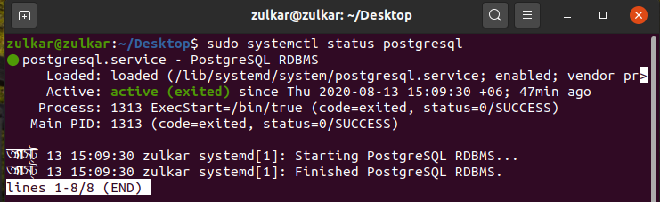
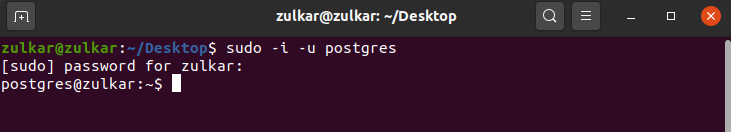
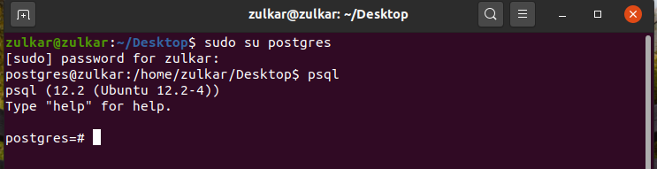
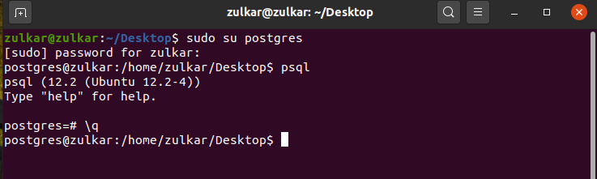
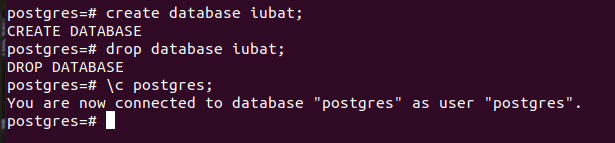

# Cloud-Research

# For Install PostgreSQL in Linux:   
sudo apt-get update   
sudo apt-get install postgresql postgresql-contrib   

# Check PostgreSQL status 
sudo systemctl status postgresql   

# Connect to psql   
sudo su postgres   
psql   

another way to access: sudo -i -u postgres

To access a Postgres prompt: psql    

# For Exit: \q     

# Create Database:
create database: create database db_name;  
drop database: drop database db_name; 
show database: \l
Current Database and User: \c postgres;

# Create Table

# Insert Data

# View Data

# Upadate Data

# Delete Data
