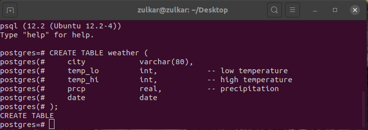
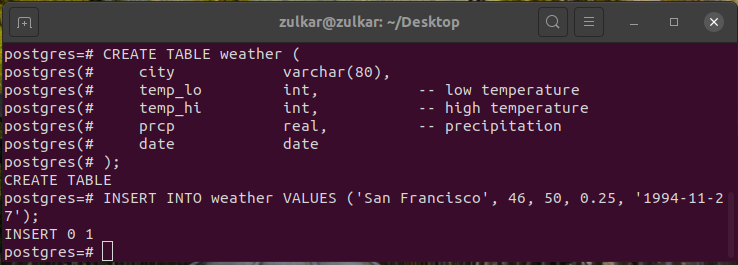
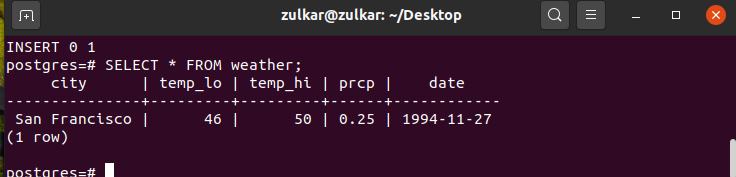
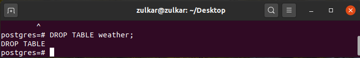

# Cloud-Research

# For Install PostgreSQL in Linux:   
sudo apt-get update   
sudo apt-get install postgresql postgresql-contrib   

# Check PostgreSQL status 
sudo systemctl status postgresql   

# Connect to psql   
sudo su postgres   
psql   

another way to access: sudo -i -u postgres

To access a Postgres prompt: psql    

# For Exit: \q     

# Create Database:
create database: create database db_name;  
drop database: drop database db_name;   
show database: \l  
Current Database and User: \c postgres;   

# Create Table:
Example code: 
CREATE TABLE weather (
    city            varchar(80),
    temp_lo         int,           -- low temperature
    temp_hi         int,           -- high temperature
    prcp            real,          -- precipitation
    date            date
);  

# Inser data:
INSERT INTO weather VALUES ('San Francisco', 46, 50, 0.25, '1994-11-27');  

# View Data
Example code: SELECT * FROM weather;  

# Drop Table:
Example code: DROP TABLE weather;  

